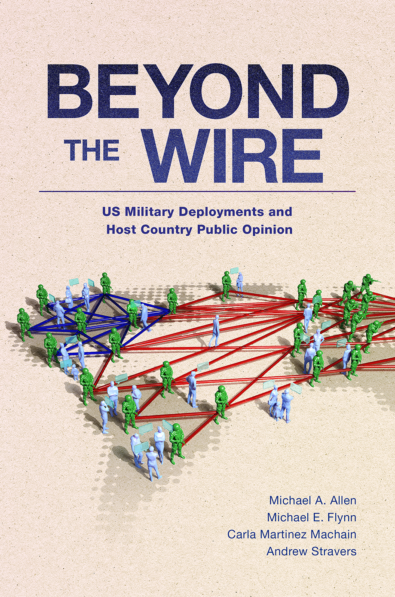

:::{.landing-page-container} 
 

:::{.grid}

:::{.g-col-12 .g-col-md-6}

:::{.profile} 

:::{.profile-pic}

:::

:::{.title-name}
Michael Flynn
:::

:::{.title-position}
Professor   Department of Political Science
:::

:::{.title-institution} 
<a href="https://www.k-state.edu/polsci/">Kansas State University</a>
:::

:::{.social-media-icons} 
  <a class="social social-envelope" href="mailto:meflynn@ksu.edu"><i class="fa-solid fa-envelope fa-2xl"></i></a>
  <a class="social social-mastodon" href="https://fosstodon.org/@michaelflynn"></a>
  
  <a class="social social-github" href="https://www.github.com/meflynn"></a>
  <a class="social social-linkedin" href="https://www.linkedin.com/in/michael-e-flynn-prior-analytics/"></a>
  
  <a class="social social-bluesky" href="https://bsky.app/profile/flynnpolsci.bsky.social"></a>
  
  <a class="social icon-cv" href="files/flynn-cv.pdf">CV</a>
:::

  
Loading recent posts…

:::

:::

:::{.g-col-12 .g-col-md-6}

:::{.profile-text} 

# **About Me** {.unlisted .unnumbered}

My name is Michael Flynn. I'm currently a professor of political science and director of the security studies program at Kansas State University. My research focuses primarily on the political economy of states' foreign policy behavior. My peer-reviewed research has appeared in the American Political Science Review, the British Journal of Political Science, International Studies Quarterly, and various other journals. I have also published several blog posts or op-eds in outlets like the Monkey Cage, The Conversation, and Political Violence @ a Glance. My research has also been featured in media outlets like The Economist, Al Jazeera, and Newsweek.

I have recently finished a book project that focuses on the politics of US overseas military deployments. This is forthcoming with Oxford University Press and will be released in October of 2022 and is available for pre-order at Amazon. Click the book image below!

{width=85% margin=auto} 

:::

:::

:::

# **Research Interests** {.unlisted .unnumbered}

Broadly speaking, my research interests include the following subjects and topic areas:

- US Foreign Policy
- Political Economy of Security
- Military Deployments
- Statistical Research Methods
- Bayesian Modeling
- Multilevel Modeling

:::

 

:::

<!-- Default Statcounter code for Michael E. Flynn -- Political Sc http://www.m-flynn.com -->

<noscript>

</noscript>
<!-- End of Statcounter Code -->